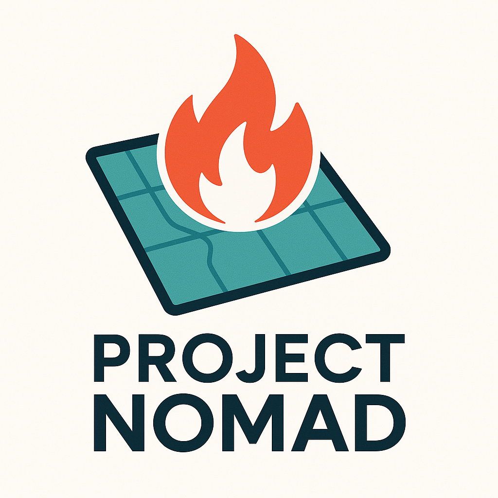
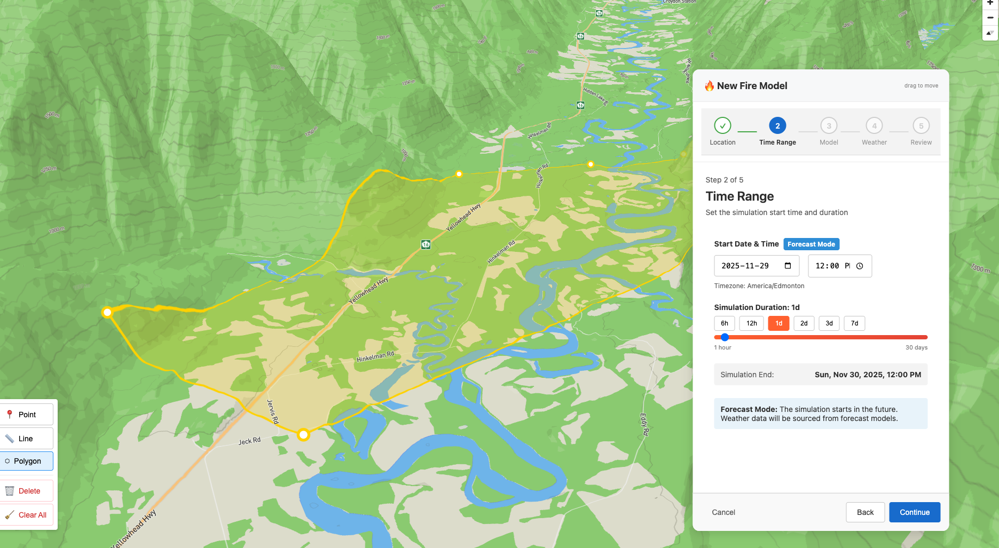

<p align="center">
  
</p>

<p align="center">
  
</p>

# Project Nomad

A national fire modeling GUI system for Canadian wildfire management.

## Mission

Democratizing fire modeling to save lives through accessible, modern interfaces that integrate multiple fire behavior prediction engines.

## Overview

Project Nomad is a TypeScript React GUI for fire modeling systems (WISE, FireSTARR). It provides a MapBox GL-based map interface for fire behavior analysis and prediction modeling in wildfire management operations.

**Current Status**: Pre-development planning phase. The repository contains specifications, SME documentation, and architectural planning - no implementation code yet.

## Deployment Modes

### SAN (Stand Alone Nomad)
Self-hosted PWA for individual users or small teams:
- Bundled frontend with local backend
- SpatiaLite for spatial data storage
- File-based authentication
- Ideal for field operations or standalone deployments

### ACN (Agency Centric Nomad)
Component integrated into existing agency infrastructure:
- Embeddable React component
- PostGIS spatial database integration
- Agency authentication systems (SSO, LDAP)
- Configuration via Git submodules for agency-specific branding and data sources

## Fire Modeling Engines

### FireSTARR (Primary)
Open-source probabilistic fire modeling:
- Monte Carlo simulation for burn probability
- Canadian FBP System implementation
- Fast C++ execution
- Active development

### WISE (Legacy Support)
Deterministic fire growth modeling:
- Prometheus heritage (Huygens wavelet propagation)
- Production-proven in Canadian agencies
- Integration via Fire Engine Abstraction Layer
- Transition path to FireSTARR

## Core Features (Planned)

**Model Setup Wizard**
- Ignition input (point, line, polygon drawing on map)
- Temporal configuration (start time, duration)
- Engine selection (WISE/FireSTARR, deterministic/probabilistic)
- Weather data integration (SpotWX, agency stations)

**Model Review**
- Fire perimeter visualization on MapBox GL
- Intensity grids, burn probability maps
- Time-stepped animation
- Export to multiple formats

**Data Sources**
- National fuel type grids
- National DEM
- ECCC weather data
- MODIS/VIIRS hotspots
- Agency-specific data via configuration

## Technical Stack

| Component | Technology |
|-----------|------------|
| Frontend | TypeScript, React |
| Map | MapBox GL JS |
| Backend | Node.js, Express, TypeScript |
| Spatial DB | SpatiaLite (SAN) / PostGIS (ACN) |
| Model Engines | FireSTARR, WISE (via abstraction layer) |

## Documentation

### SME Documentation
Comprehensive technical references for fire modeling integration:

- **FireSTARR**: `Documentation/Research/SME_Data/FireSTARR/`
- **WISE**: `Documentation/Research/SME_Data/WISE/`

### Project Specification
- `draft_plan.md` - Detailed architecture and workflow specification

### Configuration
- `demo.json` - Example data source configuration

## Project Structure

```
project_nomad/
├── assets/
│   └── logo/                 # Project branding
│       ├── nomad-logo.png    # Full logo with text
│       └── nomad-icon.svg    # Icon only (favicon)
├── Documentation/
│   └── Research/
│       ├── SME_Data/
│       │   ├── FireSTARR/    # FireSTARR technical documentation
│       │   └── WISE/         # WISE technical documentation
│       └── Onboarding/       # High-level overview docs

├── configuration/            # Agency configuration (future)
│   └── generic/              # Default open-source config
├── src/                      # Source code (future)
├── draft_plan.md             # Project specification
└── demo.json                 # Configuration example
```

## System Requirements

### Backend
- **Node.js** >= 20.0.0
- **GDAL** native libraries (for raster processing)

#### Installing GDAL

**macOS (Homebrew):**
```bash
brew install gdal
```

**Ubuntu/Debian:**
```bash
sudo apt-get install gdal-bin libgdal-dev
```

**Docker:** The backend Dockerfile includes GDAL automatically.

## Development

```bash
npm run build          # Compile TypeScript
npm run dev            # Watch mode
npm test               # Run tests
npm run lint           # ESLint
```

## MVP Outputs

Both deployment modes produce:
- Formatted input folder for FireSTARR/WISE
- CLI command for model execution
- Status tracking and notifications
- Visualization on map
- Export in standard GIS formats

## Related Projects

- **WiseGuy**: Fire Engine Abstraction Layer
  - Provides engine abstraction for WISE integration
  - Pattern for multi-engine support

## Contributing

Project Nomad is in early planning. Contact the maintainers for collaboration opportunities.

## License

TBD

---

*Project Nomad - Making fire modeling accessible to those who need it most.*
